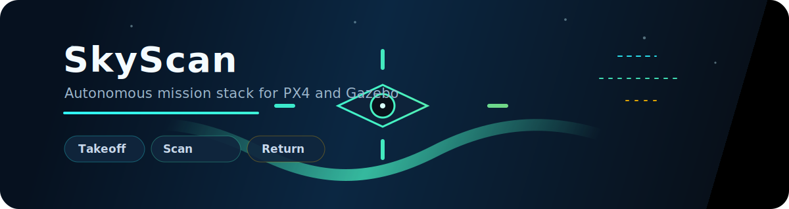

# SkyScan

SkyScan is an autonomous PX4 mission stack for the Aerothon challenge. It connects to the drone, runs the mission phases in sequence, and renders a live OpenCV HUD for simulation or flight testing.

<p align="center">
  
</p>

## What it does

- Boots the mission with a safe takeoff sequence.
- Scans for the QR target and follows the green lane.
- Handles survey, payload delivery, and return navigation.
- Streams telemetry and overlays flight-state information in the HUD.

## Project layout

- `main.py` - mission entry point and HUD loop.
- `core/` - configuration, telemetry, state, and vision helpers.
- `phases/` - mission phase logic from takeoff to return.
- `utils/` - HUD rendering, navigation, and projection utilities.

## Run it

1. Start the PX4 and Gazebo environment that provides the camera and MAVLink link.
2. Install the Python dependencies required by the mission stack.
3. Launch the mission:

```bash
python main.py
```

## Notes

- The HUD window must stay on the main OS thread.
- The mission logic runs asynchronously in a background thread.
- Keep the simulator unpaused so the camera feed reaches the vision pipeline.